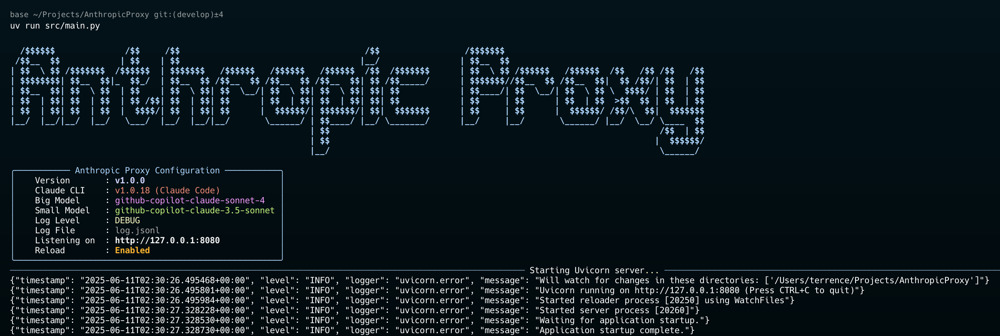

# Proxy for Anthropic/Claude API to OpenAI API

A proxy service that allows Anthropic/Claude API requests to be routed through an OpenAI compatible API to access alternative models.



## Overview

Anthropic/Claude Proxy provides a compatibility layer between Anthropic/Claude and alternative models available through either e.g. OpenRouter or OpenAI compatible API URL. It dynamically selects models based on the requested Claude model name, mapping `Opus/Sonnet` to a configured "big model" and `Haiku` to a "small model".

Key features:

- FastAPI web server exposing Anthropic/Claude compatible endpoints
- Format conversion between Anthropic/Claude API and OpenAI API requests/responses
  (see [mapping](docs/mapping.md) for translation details)
- Support for both streaming and non-streaming responses
- Dynamic model selection based on requested Claude model
- Detailed request/response logging
- Token counting

## Example

**Model**: `deepseek/deepseek-chat-v3-0324`


## Getting Started

### Prerequisites

- Python 3.10+
- OpenAI API or compatible LLM services e.g. OpenRouter key
- [uv](https://github.com/astral-sh/uv)

### Configuration

Create a `.env` file with your configuration:

```env
HOST=127.0.0.1
PORT=8080
REFERRER_URL=http://localhost:8080/AnthropicProxy
BASE_URL=http://localhost:4000
OPENAI_API_KEY=sk-
BIG_MODEL_NAME=github-copilot-claude-sonnet-4
SMALL_MODEL_NAME=github-copilot-claude-3.5-sonnet
LOG_LEVEL=DEBUG
```

See `.env.example` for more configuration options.

#### Useful environment variables

`CLAUDE_CODE_EXTRA_BODY`

`MAX_THINKING_TOKENS`

`API_TIMEOUT_MS`

`ANTHROPIC_BASE_URL`

`DISABLE_TELEMETRY`

`DISABLE_ERROR_REPORTING`

### Running the Server

```bash
$ uv --sync

$ uv run src/main.py
```

### Running Claude Code

```bash
ANTHROPIC_BASE_URL=http://localhost:8080 claude
```

## Usage

The proxy server exposes the following endpoints:

- `POST /v1/messages`: Create a message (main endpoint)
- `POST /v1/messages/count_tokens`: Count tokens for a request
- `GET /`: Health check endpoint

## License

[LICENSE](./LICENSE)
